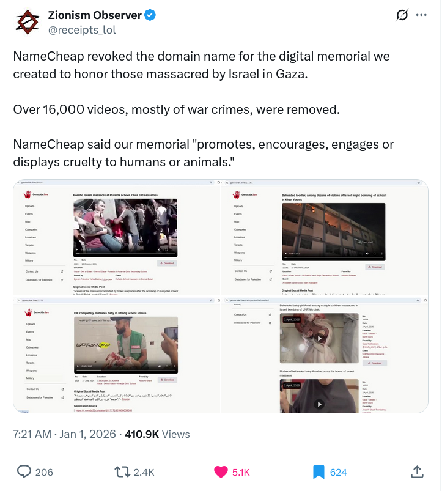

# Boycott

## Israel and any Zionist connected movement
### Alternative: Don't buy diamonds, Israel's #1 export.
For their genocides and holocausts of other peoples, including Christians.

The Nakba is the ethnic cleansing of Palestinian through their violent
displacement and dispossession of land, property, and belongings, along with the
destruction of their society and the suppression of their culture, identity,
political rights, and national aspirations.

This included many Palestinian Christians.

Now Israel is executing the Gaza Holocaust.

# Namecheap
Within two week of appointing a new Jewish CEO, they started deplatforming
websites documenting Israel war crimes, which were actively being used by
courts.

See https://x.com/receipts_lol/status/2007984691476156443
https://x.com/receipts_lol/status/2006732606164152651
https://x.com/Zamicol/status/2007152065521627571

The irony is that NameCheap convinced people to move because they were against
censorship.  Then as soon as they could, they started backstabbing customers. 

## Redfin
Redfin, for removing crime maps because they were "racist".  What an odd thing to do!

## GoFundMe 
### Alternative: GiveSendGo
for all sorts of censorship.  GoFundMe censored radiogenoa's legal defense fund.  

https://www.gofundme.com/account/impact/vwdk3p-legal-defense-fund-for-radiogenoa

## Episcopal Church
### Alternative: Be nice to White people.
Episcopal Church for discriminating against White Afrikaners.
>Episcopal Church refuses to resettle white Afrikaners, citing moral opposition
https://www.npr.org/2025/05/12/g-s1-65988/episcopal-church-white-afrikaners-ends-partnership-u-s-government

## Sony
For the rootkit scandal that they never apologized for.  https://en.wikipedia.org/wiki/Sony_BMG_copy_protection_rootkit_scandal

---
# Past Boycotts no longer in effect:

No one here yet...

